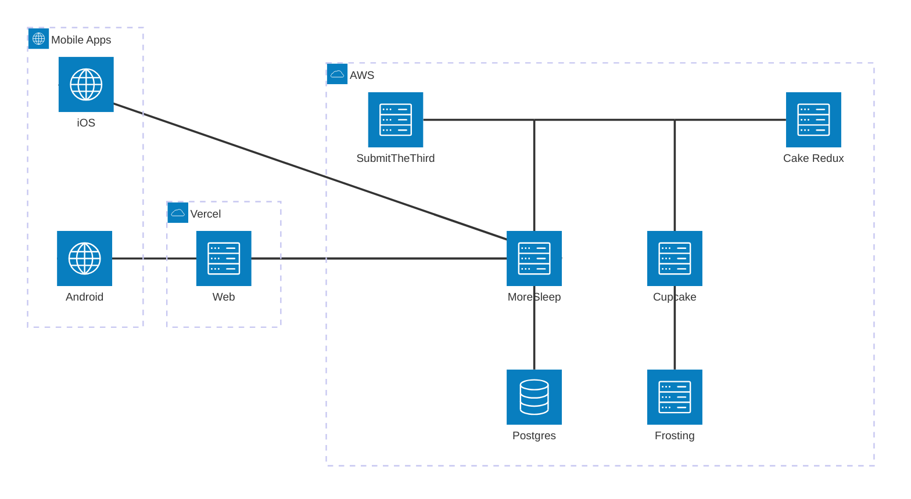

# javaBin

## JavaZone

Active systems for JavaZone:

### Websites

Currently - https://github.com/javaBin/2025.javazone.no

Planned - https://github.com/javaBin/2025.javazone.no-native

### Mobile apps

Currently - https://github.com/javaBin/javazone-ios-app and https://github.com/javaBin/javazone-android-app

Planned - https://github.com/javaBin/2025.javazone.no-native

### Sleeping Pill

Sleeping Pill is the main data store for all JavaZone talks.

It is used by [Cake](#cake), [SubmitIt](#submitit), the [website](#wesites) and the [mobile apps](#mobile-apps) to provide the data for each year.

Current repository: https://github.com/javaBin/moresleep

### Cake

Cake is the interface used by pcom to evaluate and schedule CFPs for each year.

It allows searching, filtering and tagging of talks.

Uses [Sleeping Pill](#sleeping-pill) as data store.

Current repository: https://github.com/javaBin/cake-redux

### SubmitIt

This is the system that handles JavaZone call for papers each year.

Uses [Sleeping Pill](#sleeping-pill) as data store.

Current repository: https://github.com/javaBin/submitthethird

### Moosehead

This app provides signup for workshops and JavaZone kids.

Current repository: https://github.com/javaBin/mooseheadreborn

### Switcheroo

Provides the info screens at JavaZone.

Current repository: https://github.com/javaBin/switchredux

### Cupcake and Frosting

- under development - not yet in use \*

A simpler cake providing read-only access to SP for the regions.

Current repositories:

Backend - [cupcake](https://github.com/javaBin/cupcake)
Frontend - [frosting](https://github.com/javaBin/frosting)

### Session Search

- under development - not yet in use \*

Searchable history with links to videos (where available) for all data we have available back to 2007.

Current repository: https://github.com/javaBin/session_history

### Connections

The architecture diagram in mermaid is still in beta and displays strangely - hoping that this will improve :)

## javaBin

### Web

Current repository: https://github.com/javaBin/java.no
